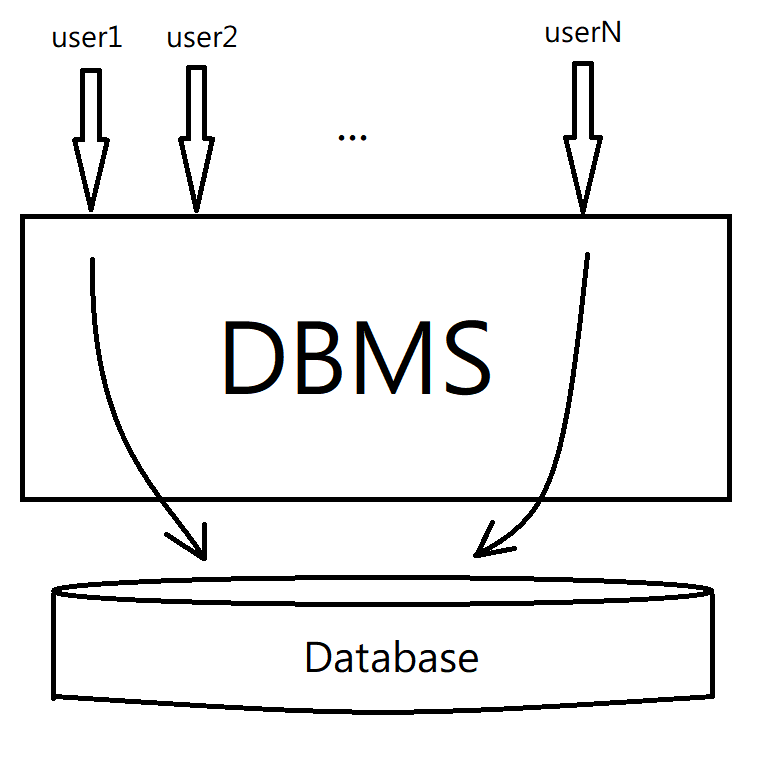

# Chapter 1 Introduction

+ DBMS contains information about a particular enterprise
  
  + Collection of interrelated data
  + Set of programs to access the data
  + An environment that is both convenient and efficient to use

+ Database systems are used to manage collections of data that are:
  
  + Highly valuable
  + Relative large
  + Accessed by multiple users and applications, often at the same time.

+ A modern database system is a complex software system whose task is to manage a large, complex collection of data.

+ Databases touch all aspects of our lives (選課、銀行、旅行社)

資料庫管理系統不等於資料庫(存放資料庫的地方)



使用者可以直接更改資料庫，或透過別人寫好的程式去操作

| 架構由下到上                 |
| ---------------------------- |
| User                         |
| Application                  |
| DBMS (buffer / file manager) |
| OS (buffer / file manager)   |
| CPU / Disk                   |
| Memory                       |

DBMS

+ SQL 的 compiler

+ 查尋資料時，要使用最有效率的演算法

+ transaction manager/ recovery (系統出錯時要修復)

## Purpose of Database Systems

為什麼不用 OS 預設的檔案系統來做管理就好了呢？

In the early days, database application were built directly on top of file systems, which leads to the following **7 drawbacks**:

1. Data redundancy(重複) and inconsistency(不一致)
   
   data is stored in multiple file formats resulting in duplication of information in different files
   
   > 比如 A, B 分別擁有同一份數據但 A 和 B 用不同存法，當 A 改了某個欄位，B 並沒有更著更改，此時就會產生不一致(inconsistency)
   
   > 在資料庫中，因為由 DBMS 管理，所以同一份資料不會有兩份 copy，至於效能的問題也是由 DBMS 自動管理所以使用者不用擔心

2. Difficulty in accessing data
   
   Need to write a new program to carry out each new task
   
   > 如果用傳統的檔案系統做管理，那麼在開發一個新的應用時，開發該應用的人必需要先了解檔案是如何儲存的，而且開發人員必需要了解 system function 才能做使用
   
   > 在資料庫中，你不需知道資料是如何儲存的 DBMS 會自己做管理，因此開發新的應用程式是會簡單許多

3. Data isolation
   
   Multiple files and formats
   
   > 傳統的檔案管理系統開發者必需了解各個檔案間的關係，才能得到他要的資料
   
   > 而在資料庫，直接透過 DBMS 就可以得到你想要的資料不需了解資料間的連結關係

4. Integrity problems
   
   + Integrity constraints (e.g., account balance > 0) become "buried" in program code rather than being stated explicitly
     
     > 傳統的檔案管理系統，要實作一些資料限制比如成績要介於 0\~100，必需要透過程式碼去限制，開發者要先讀你的code才知道。資料庫則能直接明白地表示
     
     > 使用資料庫時有一個叫 AIM 的模組 (Access & Integrity manager) DBMS 會在寫入資料時限制資料
   
   + Hard to add new constraints or change existing ones
     
     > 如果今天有新的限制，比如學校規定成績只能打到 95 分，那麼如果你用程式實作限制時就必需要把每支程式有該規則的都改掉

5. Atomicity of updates (transaction)
   
   > 資料庫的一個函式會做很多指令，若其中有出錯，資料庫會處理
   > 
   > transfer(A, B, $100) => read(A); A:=A-100; write(A); read(B); B:=B+100; write(B)
   > 
   > 若使用作業系統的 File system 則無法修復，除非是使用 journaling file system，但是也無法完美的修復
   > 
   > 資料庫也有類似 log file，但他是記錄 transfer 之前 和 transfer 之後的值，在資料庫出錯時，他會檢查 log file，如果transfer 之前和之後都有記錄就不用處理；如果只有頭有記錄尾沒有，那麼資料庫會嘗試還原
   
   + Failures may leave database in an inconsistent state with partial updates carried out
   
   + Example: Transfer of fund from one account to another should either complete or not happen at all

6. Concurrent access by multiple users
   
   > 為了提高效能，經常會使用多執行緒運作，但是如果同時有兩個用戶一個 `transfer(A, B, 100)` 另一個 `withdraw (A, 200)`
   > 
   > 
   
   + Concurrent access needed for performance
   
   + Uncontrolled concurrent accesses can lead to inconsistencies
     
     + Ex: One person reading a balance (say 100) and the other updating it by withdrawing money (say 50each) at the same time

7. Security problems
   
   + Hard to provide user access to some, but not all.

## Database systems offer solutions to all the above problems.

## View of data

> 資料庫會站在比較高的層次去看資料

+ A database system is a collection of **interrelated data** and **a set of programs** that allow users to access and modify these data.

+ A major purpose of a database systems to provide users with an abstract view of data.
  
  + Data models
    
    + A collection of conceptual tools for <mark>describing data</mark>, <mark>data relationships</mark>, <mark>data semantics (資料的意思)</mark>, and <mark>consistency constraints</mark>.
    
    > 1. hierarchical (tree model) 傳統的 model (美國早期軍方資料庫)
    > 
    > 2. graph (台灣的銀行資料庫)
    > 
    > 3. relational (把資料看成一個集合一個集合)
    > 
    > 4. OO (把資料看成一個物件)
    > 
    > 5. XML
    > 
    > ...
  
  + Data abstraction (ANSI SPARC Architecture)
    
    + Hide the complexity of data structures to represent data in the database from users through several levels of data abstraction.

## Data models

+ A collection of tools for describing
  
  + Data
  + Data relationships
  + Data semantics
  + Data constraints

+ Relational model

+ Entity-Relationship data model (mainly for database design)
  
  > Database design 有三個層面 (conceptual -> logical -> physical)
  > 
  > 1. conceptual: ER data model (把可獨立分開和有關係的資料分開)
  > 2. logical: hierarchical, graph, relational, OO, XML
  > 3. physical: 硬體層面

+ Object-base data models (Object-oriented (純物件導向)and Object-relational (把物件導向和 relation 混合))

+ Semi-structured data model (欄位不固定比較彈性 XML)

+ Other older models:
  
  + Network model
  + Hierarchical model

## Relational Model

> relation 在數學上是一種 set
> 
> logical 上是用 set
> 
> physical 上是用 table

+ All the data is stored in various tables.
+ Example of tabular data in the relational model

|       ID       |   name    | dept_name  | rank  |
| :------------: | :-------: | :--------: | :---: |
|   4106030323   |    ○毅    |   生技系   |   2   |
| **4107056003** | **林○安** | **資工系** | **1** |
|   4107056006   |   游○瑋   |   資工系   |   3   |

> 中興大學噁男資料庫 (relational model)


> Relational model 的發名者：Ted Codd

## Levels of Abstraction

### (From ANSI SPARC Architecture)

+ Physical level: describes **how** a record (e.g., instructor) is stored.

+ Logical level: describes **(what) data** stored in database, and the relationships among the data.

+ View level: application programs **hide details** of data types. Views can aloe hide information (such as an employee's salary) for security proposes.

## Instances and Schemas


+ similar to types and variables in programming languages.
+ Logical Schema -- the overall logical structure of the database
  + Example: The database consists of information about a set of customers and accounts in a bank and the relationship between them
+ Physical Schema -- the overall physical structure of the database

## Data Independence (必考)

+ physical data independence
  + change physical schema -> no change of application program.
+ logical data independence
  + change logical schema -> no change of application programs.

## Data Definition Language (DDL)

> Specification notation for defining the database schema
> 
> **告訴資料庫要怎麼建立 table**
> 
> Example:
> 
> ```sql
> create table instructor(
>     ID        char(5),
>     name      varchar(20),
>     dept_name varchar(20)
>     salary    numeric(8,2)
> )
> ```

DDL compiler generates a set of table <mark>templates</mark> stored in a data dictionary.

Data dictionary contains <mark>metadata</mark> (i.e. data about data), including

+ Database schema

+ Integrity constraints
  
  + Primary key (ID uniquely identifies instructors)
    
    > 每筆資料的 Primary key 在同一個 table 不可以相同 (類似指標、身份證字號)

+ Authorization
  
  + Who can access what


實際上 DDL complier 將 DDL 轉換時是存成 system object table 和 system column object table

**system object table**

| table name | #attr | ... |
| ---------- | ----- | --- |
| instructor | 4     |     |
| ...        | ...   |     |

attr 用來記錄 table 裡有幾個 column

**system column object table**

| COL NAME  | TABLE NAME    | DATA TYPE, Byte, ... |
| --------- | ------------- | -------------------- |
| ID        | instructor    |                      |
| name      | instructor    |                      |
| dept_name | instructor    |                      |
| salary    | instructor    |                      |
| ID        | another_table |                      |
| ...       | ...           |                      |


在 DD 裡面也儲存 Authorization, Integrity constraint,..

## Data Manipulation Language (DML)

> Language of accessing and updating the data organized by the appropriate data model. DML also knows as <mark>query language</mark> (這裡的 Query 不只可以指讀取也可以指寫入，原始的只能讀但後來改進)
> 
> Example:
> 
> ```sql
> SELECT * FROM instruction WHERE dept_name = "CS"
> ```
> 
> another action: UPDATE, INSERT, DELETE

+ There are basically two types of data-manipulation language
  
  + **Procedural DML** -- require a user to specify <mark>what</mark> data are needed and <mark>how </mark>to get those data. (不只要告訴資料他要做什麼，還要告訴他怎麼做。使用者的負擔比較重，編譯器比較簡單)
  
  + **Declarative DML** -- require a user to specify <mark>what</mark> data are needed without specifying how to get those data. (只要告訴資料他要做什麼。使用者的負擔比較少，編譯器比較不好做，但是編譯器可以最佳化的程度比較高) For example: sql

+ Declarative DMLs are usually easier to learn and use than are procedural DMLs.

+ Declarative DMLs are also referred to as **non-procedural** DMLs

+ The portion of a DML that involves information retrieval is called query language.

## SQL Query Language

原本是 IBM 開發的後來變美國標準，最後變國際標準

> SQL query language is non-procedural. A query takes as input several tables (possibly one one) and always returns a single table.

+ **SQL is NOT a Truing machine equivalent language** (計算能力不及圖靈機，但這僅限 SQL1 1982年, SQL2 1989年)

+ To be able to compute complex functions SQL is usually embedded in some higher-level language (SQL1, SQL2, but not SQL3 1999年)

+ Application programs generally access database through one of
  
  + Language extensions to allow embedded SQL
  
  + Application program interface (e.g., ODBC/JDBC) which allow SQL queries to be sent to a database

---

1. None-procedural query languages such as SQL are not as powerful as a universal Turing machine.

2. SQL does not support actions such as input from users, output to displays, or communication over the network.

3. Such computations and actions must be written in a host language, such as C/C++, Java or Python, with embedded SQL queries that access the data in the database.

4. Application programs -- are programs that are used to interact with the database in this fashion.

## Database Design

The process of designing the general structure (schema) of the database:

### Logical Design (決定 What)

> Deciding on the database (logical) schema. Database design requires that we find a "good" collection of relation schemas.

+ Business decision (業務需求) -- What attributes should we record in the database?

+ Computer Science decision (技術上) -- What relation schemas should we have and how should the attributes be distributed among the various relation schemas? (哪些資料要放在哪個 table 哪個不行)

### Physical Design (決定 How)

> Deciding on the physical layout of the database
> 
> (Performance 為主)