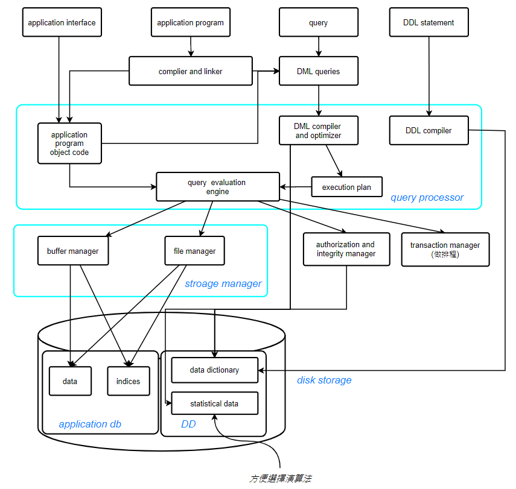
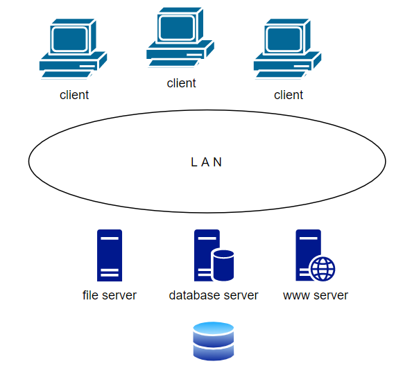

## Chapter 1 Introduction (cont.)

## Database Engine

A database system is partitioned into modules that deal with each of the responsibilities of the overall system.

The functional components of a database system can be divided into

1. The storage manager component

2. The query processor component

3. The transaction management component

### Storage manager

A program module that provides the interface between the low-level data stored in the database and the application programs and queries submitted to the system.

The storage manager is responsible for the following tasks:

+ Interaction with the OS file manager (DBMS 必需透過 OS 才能使用檔案資料)

+ Efficient storing, retrieving and updating of data (讀資料時可以不要進 disk 讀)(DBMS 有自己的 Buffer Manager)

The storage manager components include:

+ ~~Authorization and integrity manager~~

+ ~~Transaction manager~~

+ File manager

+ Buffer manager

The storage manager implements several data structures as part of the physical system implementation:

### Database Processor

+ The query processor components include:
  
  + **DDL(Data definition lang) interpreter** -- interprets DDL statements and records the definitions in the data dictionary.
  
  + **DML(Data manipulation lang) compiler** -- Translate DML statements in a query language into an <u>evaluation plan</u> consisting of low-level instructions that the query evaluation engine understands.
1. Parsing and translating
   
   + Parser 會檢查語法 (SQL) 有沒有問題，如果沒有問題就會把語法交給 translator，轉換成 relational-algebra expression

2. Optimization
   
   + Optimizer 將 relational-algebra expression 做優化
     
     > 1. Machine independent optimization (rewrite program)
     >    
     >    > 語法優化，比如恆等式
     > 
     > 2. Machine dependent optimization
     >    
     >    > 挑演算法

3. translating
   
   > 轉換為 machine code

4. Evaluation

### Transaction Manager

> A transaction is a collection of **CPU** operations that performs a single logical function in a database application.
> 
> 把轉帳 6 個動作當成 1 個動作
> 
> **Recovery manager**: Ensure that the database remains in a **consistent (correct) state despite system failure** (e.g. power failures and operating system crashes) and transaction failures. (ensure Atomicity and Durability)
> 
> > Remote backup 異地備份
> > 
> > e.g. 勞保局一台資料庫在台北羅斯福路有一台，另一台在桃園。證券公司 non-stop system ，一邊壞了另一邊還能繼續運作
> 
> **Concurrency-control manager:** Controls the interaction among the concurrent transactions, to ensure the consistency of the database. (ensure Consistency and Isolation)
> 
> > Concurrency-control manager 用的是一些 protocol 

#### Transaction properties

A - C - I - D

1. **Atomicity:** (一個 transaction 的指令不可以分割)，要就把 6 個步驟做完，不然就都不要做

2. **Consistency:** (類似 correct 和 valid, 但 correct 的用字太強，代表是正確且唯一，而 consistency 只要是正確即可) 每個 transaction 的指令做完都要是對的

3. **Isolation:** 同時有兩個 transaction 指令 T1 和 T2 ，不管是先執行 T1 還是先執行 T2 都是對的 (雖然答案不一定一樣)，但是，如果是交由 OS 同時執行有可能會造成錯誤的答案
   
   > 雖然 T1, T2, ... Tn 同時一起做，但由 Database Transaction Management 排程出來的結果，不會造成結果錯誤

4. **Durability (Persistency):** Database 算出來的結果後，就已經確定了，不可以因為其他的錯誤、天災...等導致資料錯誤

> Atomicity, Durability 談的是 failure 的問題 (由 Recover manager 負責)
> 
> Consistency, Isolation 談的是 consistency 的問題 (由 Concurrency-control manager 負責)

## Database Architecture

+ Centralized database
  
  + One to a few cores, shared memory
  
  > 傳統的 database
  > 
  > 
  > 
  > 

+ Client-server
  
  + One server machine executes work on behalf of multiple client machines
  
  > 

+ Parallel databases
  
  + Many core shared memory
  + Shared disk
  + Shared nothing

+ Distributed databases
  
  > 
  > 
  > 每一個 site 都是獨立的，要處理資料時，先處理自己的資料庫，在透過 WAN 處理其他的資料庫
  > 
  > 一開始建立時就會盡量選相同的作業系統、相同的資料庫... (Homogeneous) 由上而下做整合，比如銀行
  > 
  > 如果是用不同的作業系統，不同的資料庫... (Heterogeneous)，由下而上做整合，比如各大學圖書館資料的整合
  
  + Geographical distribution
  + 系統的異值性
  + Schema/data heterogeneity (資料的異值性)

## Database Applications

Two-tier architecture, Three-tier architecture

Three-tier 把 Two-tier 的 application 分成兩層 application client 和 application server 

選課系統用的是 Three-tier 的架構，選課介面呈現的是 application client， 電算中心內的是 application server

## Database Users

1. Naive users → application interfaces

2. Application programmers → application programs

3. Database designer → 配合 application programmers 設計儲存的架構 (DDL statement)

4. Sophisticated users →query tools

5. database administrators → administration tools

### Database Administrator

A person who has central control over the system is called a database administrator(DBA). Responsibilities of a DBA include:

+ Schema definition

+ Storage structure and access-method definition

+ Schema and physical-organization modification

+ Granting of authorization for data access

+ Routine maintenance

+ Periodically backing up the database

+ Ensuring that enough free disk space is available for normal operations, and upgrading disk space as required

+ Monitoring jobs running on the database
