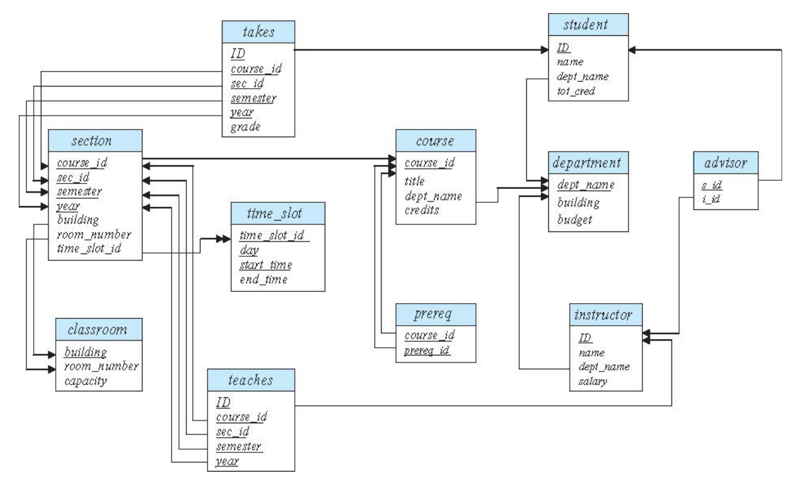

# Chapter2: Intro to Relational Model

中興噁男排名 (pervert table)

| ID         | name | dept_name | rank |
|:----------:|:----:|:---------:|:----:|
| 4106030323 | 〇毅   | 生技系       | 2    |
| 4107056003 | 林〇安  | 資工系       | 1    |
| 4107056006 | 游〇瑋  | 資工系       | 3    |
| 4107056012 | 黃〇凱  | 資工系       | 8    |

學系學院對照表 (college table)

| dept\_name | college  |
| ---------- | -------- |
| 資工系     | 電資學院 |
| 資電學士班 | 電資學院 |
| 生技系     | 農資學院 |

## Relation Schema and Instance

+ A1, A2, A3, ... are attributes

+ R = (A1, A2, A3, ... ,An) is a relation schema
  
  + e.g.
    
    > pervert = (ID, name, dept\_name, rank)

### Attributes

+ The set of allowed values for each attribute is called the **domain of the attribute**.
  
  > domain 這個術語如同程式語言常說的 datatype

+ Attribute values are (normally) required to be atomic

## Database Schema

+ Database schema -- is the <u>logical structure</u> of the database.

+ Database instance -- is a snapshot of the data in the database at a given instant  in time.

+ Example
  
  + schema: pervert(ID, name, dept\_name, rank)
  
  + instance:
    
    | ID         | name | dept_name | rank |
    |:----------:|:----:|:---------:|:----:|
    | 4106030323 | 〇毅   | 生技系       | 2    |
    | 4107056003 | 林〇安  | 資工系       | 1    |
    | 4107056006 | 游〇瑋  | 資工系       | 3    |
    | 4107056012 | 黃〇凱  | 資工系       | 8    |

**↑表2-1**

## Keys

> 用來區別資料用的
> 
> 比如 組合語言中的 address, 物件導向中的 OID
> 
> 資料庫中的 Key 就是一種 naming schema

+ Let K ㄈ R

+ K Is a <mark>superkey</mark> of R if values for **K** are sufficient to identify a unique tuple of each possible relation r(R) i.e. to name a tuple in a relation
  
  > 中興噁男資料表中的 name 不能當 key 因為可能有兩個噁男的 name 是同一個值。key 必需是永遠不會重複的，有特殊設計的，比如學號
  > 
  > e.g. (ID) and (ID, name) are both superkeys of pervert.

+ Super key is a <mark>candidate key</mark> if K is minimal
  
  + e.g. (ID)

+ One of the candidate keys is selected to be the primary key
  
  + Which One?
  + 在設置 primary key 時，資料庫為了避免值重複，所以會自動建立 index，因此在選擇 primary key 時，應該選擇最常被 query 的欄位

+ <u>Foreign key</u> constraint: Value in one relation must appear in another
  
  > 某個 table 的欄位是另一個 table 欄位中的 primary key
  
  + Referencing relation
  
  + Referenced relation
  
  + e.g. pervert table 中的 dept\_name 是來自 department table 的 foreign key

| dept\_name | college |
| ---------- | ------- |
| 資工系        | 電資學院    |
| 資電學士班      | 電資學院    |
| 生技系        | 農資學院    |

another example:

takes 中的 <u>id</u> 是 foreign key, advisor 的 <u>s\_id</u> 是 foreign key

## Relational Module

> 1. structure 
> 
> 2. query language (尋找資料用的又分兩類)
>    
>    1. procedural (需要某個資料時我要給予資料庫指示)
>    
>    2. declarative (需要某個資料時，只需要給予你所需要的資料的條件)

"Pure" language: (Language module)

1. relational algebra (RA)
   
   > 透過運算得到新的東西
   > 
   > relational algebra 基本運算單位就是一個 set
   > 
   > 比如做交集、聯集
   > 
   > e.g. 
   > 
   > > R.A.: ∏ name(σ dept_name='cs'(instructor)) Λ salary > 10⁵

2. relational calculus
   
   > 透過條件的方式來選取資料
   
   1. Tuple relational calculus (一筆資料)
      
      e.g.
      
      > T.R.C.: {t.name| t ε instructor }
   
   2. Domain relational calculus (一欄資料)
      
      e.g.
      
      > D.R.C.: {<n> | <i, n, d, s> ε instructor (ID, name, dept_name, salary) Λ dept\_name='cs' salary ≥ 10⁵}

The above 3 pure languages are **not really** equivalent in computing power. e.g. 如果你要用表示 R.A. 表示 

> T.R.C {¬t | t ε instructor}

一般的情況下這三個 pure languages 是 equivalent 只有在表示不在範圍內的資料時 R.A. 會無法表示

## Relational Algebra

six basic operation

+ select: σ 

+ project: ∏
+ union: ∪
+ set difference: –
+ Cartesian product: x
+ rename: ρ

### Select Operation σ

The "select" operation selects tuples that satisfy a given predicate.

+ Notation: $σ_p(r)$

+ p is called the **selection predicate**

|     ID     |  name  | dept_name | rank |
| :--------: | :----: | :-------: | :--: |
| 4106030323 |  〇毅  |  生技系   |  2   |
| 4107056003 | 林〇安 |  資工系   |  1   |
| 4107056006 | 游〇瑋 |  資工系   |  3   |
| 4107056012 | 黃〇凱 |  資工系   |  8   |

Query: 

> $σ_{name="林〇安"}\ (pervert)$

Result:

|     ID     |  name  | dept_name | rank |
| :--------: | :----: | :-------: | :--: |
| 4107056003 | 林〇安 |  資工系   |  1   |

### Project Operation ∏

A unary operation that returns its argument relation, with certain attributes left out.

+ Notation:  $∏_{A_1, A_2, A_3,...,A_k}(r)$

  where $A_1, A_2, A_3,...,A_k$ are attribute names and $r$ is a relation name.

+ The result is defined as the relation of k column obtained by erasing the column that are not listed.

+ **Duplicated rows removed from result**, since relations are sets.

|     ID     |  name  | dept_name | rank |
| :--------: | :----: | :-------: | :--: |
| 4106030323 |  〇毅  |  生技系   |  2   |
| 4107056003 | 林〇安 |  資工系   |  1   |
| 4107056006 | 游〇瑋 |  資工系   |  3   |
| 4107056012 | 黃〇凱 |  資工系   |  8   |

Query:

> $∏_{name, rank}(r)$

Result:

|  name  | rank |
| :----: | :--: |
|  〇毅  |  2   |
| 林〇安 |  1   |
| 游〇瑋 |  3   |
| 黃〇凱 |  8   |

### Cartesian-Product Operation X

The Cartesian-Product Operation (denoted by X) allows us to combine information from any two relations.

Query:

> pervert X college

Result:

|     ID     |  name  | pervet.dept | rank | college.dept | college  |
| :--------: | :----: | :---------: | :--: | ------------ | -------- |
| 4106030323 |  〇毅  |   生技系    |  2   | 資工系       | 電資學院 |
| 4106030323 |  〇毅  |   生技系    |  2   | 資電學士班   | 電資學院 |
| 4106030323 |  〇毅  |   生技系    |  2   | 生技系       | 農資學院 |
| 4107056003 | 林〇安 |   資工系    |  1   | 資工系       | 電資學院 |
| 4107056003 | 林〇安 |   資工系    |  1   | 資電學士班   | 電資學院 |
| 4107056003 | 林〇安 |   資工系    |  1   | 生技系       | 農資學院 |
| 4107056006 | 游〇瑋 |   資工系    |  3   | 資工系       | 電資學院 |
| 4107056006 | 游〇瑋 |   資工系    |  3   | 資電學士班   | 電資學院 |
| 4107056006 | 游〇瑋 |   資工系    |  3   | 生技系       | 農資學院 |
| 4107056012 | 黃〇凱 |   資工系    |  8   | 資工系       | 電資學院 |
| 4107056012 | 黃〇凱 |   資工系    |  8   | 資電學士班   | 電資學院 |
| 4107056012 | 黃〇凱 |   資工系    |  8   | 生技系       | 農資學院 |

### Join Operation ⋈

The "join" operation allows us to combine a "select" operation and a Cartesian-Product

"theta join": 是條件，滿足條件就是相關

"natural join": 相同欄位要有相同的值 (default) 

Notation: 

> $r⋈_{\theta} s = σ_{\theta}(r{\times}s)$
>
> r and s are table name
>
> $\theta$ is a condition

Query: 

> $σ_{pervert.dept=college.dept} (pervert\ X\ college))$

or

> $pervert ⋈_{pervert.dept=college.dept} college$

Result:

|     ID     |  name  | pervert.dept | rank | college.dept | college  |
| :--------: | :----: | :----------: | :--: | ------------ | -------- |
| 4106030323 |  〇毅  |    生技系    |  2   | 生技系       | 農資學院 |
| 4107056003 | 林〇安 |    資工系    |  1   | 資工系       | 電資學院 |
| 4107056006 | 游〇瑋 |    資工系    |  3   | 資工系       | 電資學院 |
| 4107056012 | 黃〇凱 |    資工系    |  8   | 資工系       | 電資學院 |

### Union Operation ∪

The union operation allows us to combine two relations

+ Notation: $r\, \cup\, s$

For $u \cup s$ to be valid.

1. r, s must have the same **arity** (same number of attributes)
2. The attribute domains must be compatible (e.g. 2nd column of *r* deals with the same type of values as does the 2nd column of *s*)

Query:

> $∏_{name}(σ_{dept\_name="生技系"}(pervert))\ \cup\ ∏_{name}(σ_{rank=3}(pervert))$

result:

|  name  |
| :----: |
|  〇毅  |
| 游〇瑋 |

### Set Intersection Operation ∩

The set intersection operation allows us to find tuples that are in both the input relations.

+ Notation: $r\, \cap\, s$

Assume:

+ r, s have the same arity
+ attributes of *r* and *s* are compatible

Query:

> $∏_{name}(σ_{dept\_name="資工系"}(pervert))\ \cap\ ∏_{name}(σ_{rank=1}(pervert))$

result:

|  name  |
| :----: |
| 林〇安 |

### Set Difference Operation -

The set-difference operation allows us to find tuples that are in one relation but are not in another.

+ Notation: $r-s$

set difference must be taken between **compatible** relations.

+ *r* and *s* must have the same arity
+ attribute domains of *r* and *s* must be compatible

Query:

> $∏_{name}(σ_{dept\_name="資工系"}(pervert))\ - ∏_{name}(σ_{rank=1}(pervert))$

Result:

|  name  |
| :----: |
| 游〇瑋 |
| 黃〇凱 |

### The Assignment Operation ←

It is convenient at times to write a relational-algebra expression by assigning parts of it to temporary relation variables.

+ Notation:  new\_name← some\_expressions

+ The assignment operation is like assignment in a programming language.

+ With the assignment operation, a query can be written as a sequential program consisting of a series of assignments followed by an expression whose value is displayed as the result of the query.

### The rename Operation ρ

The results of relational-algebra expressions do not have a name that we can use to refer to them.

+ Notation: $ρ_x (E)$

  returns the result of expression $E$ under the name $x$

---

> **NOTE**
>
> 1. $ρ_{disgusting} (E)$
>
> 2. $disgusting ← E$
>
> 這兩個所表達的意思不一樣，第 2 個是指在額外花一個空間去存，而第 1 個則只是更名而已

### Equivalent Queries

There is **more than one way to write a query** in relational algebra.

e.g. Find information about name in the 資工系 with rank smaller than 3

> Query1
> $$
> \sigma _{dept\_name="資工系" \text{^} rank<3}(name)
> $$
> Query2
> $$
> \sigma_{dept\_name = "資工系"}(\sigma_{rank<3}(name))
> $$