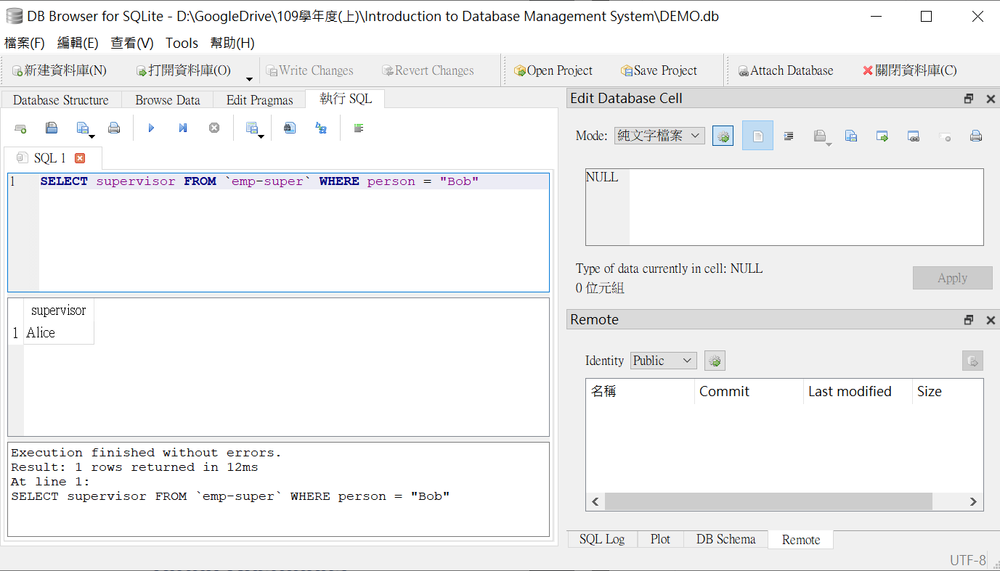

# Chapter 3 Introduction to SQL

## Overview

本章在介紹 SQL 操作，因為太抽象了，所以以 SQLite 實作

使用軟體：[DB Browder for SQLite](https://sqlitebrowser.org/)



## History

IBM **Sequel language** developed as part of System R project at the IBM.

Renamed **Structured Query Language**

ANSI and ISO standard SQL:

+ SQL-86 (第:one:代)
+ SQL-89
+ SQL-92 (第:two:代，只能做簡單的查尋)
+ SQL:1999 (第:three:代，已經做到 Turing machine 等級了)
+ SQL:2003

Commercial system offer most, if not all, SQL-92 features, plus varying feature sets from later standards and special proprietary features.

## SQL Parts

1. DDL: (Data define language) Define relational schema
   1. structure
   2. integrity
   3. view (定義哪些資料可以給別人看，哪些資料不能給別人看)
   4. authorization (定義誰可以讀，誰可以寫，可以賦予權限，可以收回權限)
2. DML: provides the ability to query information

3. DCL: transaction control -- includes commands for specifying the beginning and ending of transactions
4. Embedded SQL and dynamic SQL(dynamic: 像直譯器一樣翻譯一行直行一行...) -- 把 SQL 放進一般的程式中。dynamic sql，程式執行時可以將sql做更改

### DDL

#### Domains in SQL

+ `char(n)`. Fixed length character string, with user-specified length n.
+ `varchar(n)`. Variable length character strings, with user-specified maximum length n.
+ `int`. (the finite subset of the integers that is machine-dependent)
+ `smallint`.
+ `numeric(p, d)`. Fixed point number, witch user-specified precision p digits, with d digits to the right of decimal point.

+ `real`, `double precision`. Floating point and double-precision floating point numbers, with machine-dependent precision.
+ `float(n)`. Floating point number, with user-specified precision of at least n digits.

#### Schema operation

+ create table

  + create a table and define its schema and integrity

  ```sqlite
  create table pervert(
      ID         int,
      name       varchar(20) not null,
      dept_name  varchar(50),
      rank       smallint,
      yy         smallint,
      primary key(name, yy),
      foreign key(dept_name) references college(dept_name)
  );
  
  create table college(
      dept_name  varchar(50),
      college    varchar(50),
      primary key(dept_name)
  );
  ```

  pervert:

  |     ID     |  name  | dept_name | rank |  yy  |
  | :--------: | :----: | :-------: | :--: | :--: |
  | 4107056002 | 許〇全 |  資工系   |  -1  | 2020 |
  | 4107056003 | 林〇安 |  資工系   |  1   | 2020 |
  | 4107056006 | 游〇瑋 |  資工系   |  3   | 2020 |
  | 4107056003 | 林〇安 |  資工系   |  0   | 2019 |
  | 4107056002 | 許〇全 |  資工系   |  1   | 2019 |
  | 4106030323 |  〇毅  |  生技系   |  2   | 2020 |

  college:

  | dept\_name | college  |
  | ---------- | -------- |
  | 資工系     | 資電學院 |
  | 資電學士班 | 資電學院 |
  | 生技系     | 農資學院 |

+ drop table

  + eliminate a table and remove its schema

  ```sql
  drop table r
  ```

+ alter table

  + change a table's schema by adding new attributes or deleting existing attributes

  ```sql
  alter table r add A D
  ```

  where A is the name of attribute to be added to relation r and D is the domain of A

  ```sql
  alter table r drop A
  ```

  where A is the name of an attribute of relation r

  Dropping of attributes not supported by many databases.

+ create view ── 該範例附有 SQLite 實作

  ```sql
  create view pervert_2020(id, name, college)
  as select id, name, college
  from pervert, college
  where pervert.dept_name = college.dept_name and pervert.yy = 2020
  ```

pervert_2020:

|     ID     |  name  | college  |
| :--------: | :----: | :------: |
| 4107056002 | 許〇全 | 資電學院 |
| 4107056003 | 林〇安 | 資電學院 |
| 4107056006 | 游〇瑋 | 資電學院 |
| 4106030323 |  〇毅  | 農資學院 |

### DML:  Basic Query Structure

#### Select

+ correspond to the **project operation** of the relational algebra

+ A typical SQL query has the form

  ```sql
  SELECT A1, A2,..., An
  FROM r1, r2, ..., rn
  WHERE p
  ```

  e.g. find the name in pervert

  ```sql
  SELECT name FROM pervert
  ```

  |  name  |
  | :----: |
  |  〇毅  |
  | 林〇安 |
  | 林〇安 |
  | 游〇瑋 |
  | 許〇全 |
  | 許〇全 |

  SQL **allows duplicates** in relations as well as in query results (考量效能)

+ To force the elimination of duplicates, insert the keyword **distinct** after select.

  ```sql
  SELECT DISTINCT name FROM pervert
  ```

  |  name  |
  | :----: |
  |  〇毅  |
  | 許〇全 |
  | 林〇安 |
  | 游〇瑋 |

##### self-join

consider the table *emp-super*  ── 該範例附有 SQLite 可供實作

| person | supervisor |
| :----: | :--------: |
|  Bob   |   Alice    |
|  Mary  |   Susan    |
| Alice  |   David    |
| David  |    Mary    |

+ Find the supervisor of "Bob"

  ```sql
  SELECT supervisor FROM `emp-super` WHERE person = "Bob" 
  ```

  | supervisor |
  | :--------: |
  |   Alice    |

+ Find the supervisor of the supervisor of "Bob"

  ```sql
  SELECT r2.supervisor FROM `emp-super` as r1, `emp-super` as r2 WHERE r1.person = "Bob" and r1.supervisor = r2.person
  ```

  | supervisor |
  | :--------: |
  |   David    |

+ Can you find ALL the supervisors (direct and indirect) of "Bob"?

  You need a recursive query language, SQL 做不到 (要使用 logic program)

##### string operation

+ percent (%) The % character matches any substring. 

  ```sql
  SELECT name FROM pervert WHERE name LIKE '%子%'
  ```

  To match %, use escape backslash  `\` . See below

  ```sql
  SELECT ... FROM ... WHERE ... LIKE '100\%' escape '\'
  ```

  Can also use

  ```sql
  SELECT ... FROM ... WHERE ... LIKE '100$%' escape '$'
  ```

+ underscore (\_) The \_ character matches any character.

  + _ _ _ matches any string of exactly three characters
  + _ _ _ % matches any string of at least three characters


##### order

ASC: ascending ／ DESC: descending

```sql
SELECT name FROM pervert ORDER BY rank ASC

SELECT name FROM pervert ORDER BY rank DESC
```

#### Where

##### between

```sql
SELECT name FROM pervert WHERE rank BETWEEN 0 and 3
```

Finding rank ≥ 0 and rank ≤ 3

##### Tuple comparison

```sql
SELECT name, college FROM pervert, college WHERE
(pervert.dept_name, yy) = (college.dept_name, 2019);
```

|  name  | college  |
| :----: | :------: |
| 林〇安 | 資電學院 |
| 許〇全 | 資電學院 |

##### Set operation

使用 union, intersect, except 計算時，視為數學上的集合，應此不可以有 duplicate 出現。如果不考慮 duplicate 有沒有出現可以改用 union all, intersect all, except all

except 指的是差集 (minus)

```sql
SELECT name FROM pervert WHERE rank = 1
UNION
SELECT name FROM pervert WHERE dept_name = "資工系"
```

```sql
SELECT name FROM pervert WHERE rank < 3
INTERSECT
SELECT name FROM pervert WHERE dept_name = "資工系"
```

```sql
SELECT name FROM pervert WHERE yy = 2020
EXCEPT
SELECT name FROM pervert WHERE dept_name = "生技系"
```

##### Null values

> It is possible for tuples to have a null value, denoted by null, for some of their attributes.
> null signifies an unknown value or that a value does not exist.
> The result of any arithmetic expression involving null is null.
>
> > 5 + null = null
>
> The predicate `is null` can be used to check null values
>
> ```sql
> SELECT name FROM pervert WHERE rank is null
> ```
>
> `rank = null` doesn't work because `anything = null` is FALSE 
>
> All of below return FALSE
>
> + 5 < null
> + null <> null
>
> + null = null

如果 rank 欄位中有一筆資料是 null

> + where rank < 3
>
>   null 的那筆不會被選擇，因為 null < 3 是 FALSE
>
> + where NOT (rank >= 3)
>
>   null 的那筆會被選擇因為 FALSE 會又被加了 NOT 變成 TRUE

看似一樣的條件式確會得到不同的結果，因此，**我們要改用三態邏輯來實作以避免這種情況發生**

| AND   | T    | U    | F    |
| ----- | ---- | ---- | ---- |
| **T** | T    | U    | F    |
| **U** | U    | U    | F    |
| **F** | F    | F    | F    |

| OR    | T    | U    | F    |
| ----- | ---- | ---- | ---- |
| **T** | T    | T    | T    |
| **U** | T    | U    | U    |
| **F** | T    | U    | F    |

| NOT  |      |
| ---- | ---- |
| T    | F    |
| U    | U    |
| F    | T    |

> + where rank < 3
>
>   null < 3 為 Unknown，最後當作 FALSE
>
> + where NOT (rank >= 3)
>
>   null >= 3 為 Unknown 做 NOT 變為 Unknown ，因為最後無法繼續計算所以當做 FALSE

#### Aggregate Functions

+ avg
+ min
+ max
+ sum
+ count: number of values

```sql
SELECT avg(rank) FROM pervert WHERE yy = 2019

SELECT count(distinct name) FROM pervert WHERE yy = 2019

SELECT count(*) FROM college
```

##### Group By

|     ID     |  name  | dept_name | rank |  yy  |
| :--------: | :----: | :-------: | :--: | :--: |
| 4107056002 | 許〇全 |  資工系   |  -1  | 2020 |
| 4107056003 | 林〇安 |  資工系   |  1   | 2020 |
| 4107056006 | 游〇瑋 |  資工系   |  3   | 2020 |
| 4107056003 | 林〇安 |  資工系   |  0   | 2019 |
| 4107056002 | 許〇全 |  資工系   |  1   | 2019 |
| 4106030323 |  〇毅  |  生技系   |  2   | 2020 |

```sql
SELECT yy, COUNT(*) as num FROM pervert GROUP BY yy
```

| yy   | num  |
| ---- | ---- |
| 2019 | 2    |
| 2020 | 4    |

**NOTE**

Attributes in select clause outside of aggregate functions must appear in group by list.

```sql
SELECT yy, name, COUNT(*) as num FROM pervert GROUP BY yy
--------------------------------------------------------------
ERROR: 因為 name 不在 Group name 裡面
```

##### Having

```sql
SELECT yy, COUNT(*) as num FROM pervert GROUP BY yy HAVING num > 2
```

| yy   | num  |
| ---- | ---- |
| 2020 | 4    |

##### Nested Subqueries

+ 查找 2019資工噁男 及 2020生技噁男

```sql
SELECT DISTINCT name FROM pevert
WHERE yy = 2019 and dept_name = '資工系' and
name in (
	SELECT name
    FROM pervert
    WHERE yy = 2020 and dept_name = '生技系'
)
```

##### Some

