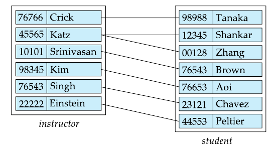
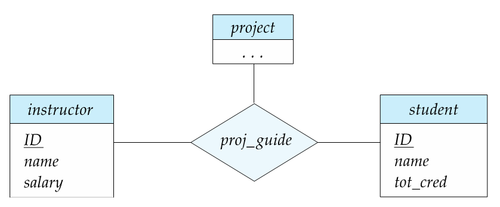
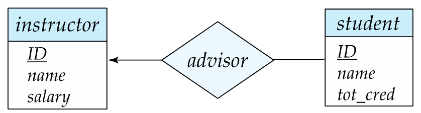
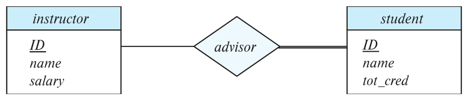
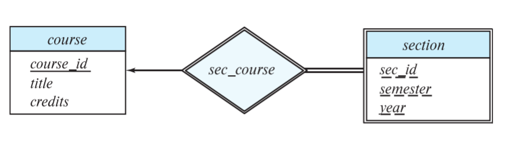
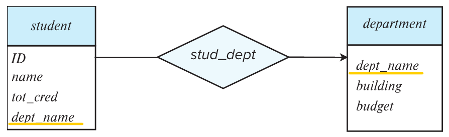

# Chapter 6: Database Design Using the E-R model

> 設計過程
> 
> 1. data processor requirement
> 2. conceptual design
> 3. conceptual schema (本章用 E-R model 表示)
> 4. logical DB design
> 5. logical schema
> 6. physical DB design
> 7. physical schema (layout)
> 
> conceptual
> 
> + The entity-relationship model
> + complex attributes
> + mapping cardinalities
> + primary key
> + removing redundant attributes in entity sets
> 
> logical
> 
> + reducing ER Diagram to relational schema

## Design phases

initial phase - characterize fully the data needs of the prospective database users. 要跟客戶溝通

second phase - choosing a data model

+ Applying the concepts of the chosen data model
+ Translating these **requirements into a conceptual schema** of the database
+ A fully developed conceptual schema indicates the data requirements of the enterprise

Final phase - Moving from an abstract data model to the implementation of the database

+ logical design - deciding on the database schema. Database design requires that we find a "good" collection of relation schemas.
  + Business decision - What attributes should we record in the database? (商業上的考量 ─ 沒必要放的就不要放)
  + Computer Science decision - What relation schemas should we have and how should the distributed among the various relation schemas? (避免有冗餘的資料)
+ physical design - deciding on the physical layout of the database

## Design Alternatives

In designing a database schema, we must ensure that we avoid two major pitfalls.

+ Redundancy: a bad design may result in repeat information.
+ Incompleteness: a bad design may make certain aspects of the enterprise difficult or impossible to model.

## Design Approaches

+ **E**ntity **r**elationship model (E-R model)
+ Normalization theory (Chapter 7)
  + formalize what designs are bad, and test for them

## Entity

> An **entity** is an object that exists and is distinguishable from other objects. 
> 
> + e.g. specify person, company, event, plant.
> 
> An **entity set** is a set of entities of the same type that share the same properties.
> 
> + e.g. set of all persons, companies, holidays, trees.
> 
> An entity is represented by a set of attributes: i.e., descriptive properties possessed by all members of an entry set.
> 
> + e.g.
>   instructor = (ID, name, salary)
>   course = (course_id, title, credits)
> 
> A subset of the attributes from a primary key of entity set

## Relationship Sets

A **relationship** is an association among several entities

A **relationship set** is a mathematical relation among n>=2 entities, each taken from entity sets

An attribute can also be associated with a relationship set.

e.g., the advisor relationship set between entity sets instructor and student may have the attribute date which tracks when the student started being associated which the advisor

### Degree of a Relationship set

+ Binary relationship
  + involve two entity sets (or degree two)
  + most relationship sets in a database system are binary
+ Relationships between more than two entity sets are rare. Most relationships are binary

e.g.: **ternary relationship**

### Complex attributes

Attribute types:

+ **simple** and **composite** attributes
  + composite attributes allow us to divided attributes into subparts
+ **single-valued** and **multivalued attributes**. e.g. multivalued attributes: phone_numbers
+ **Derived attributes**: can be computed from other attributes. e.g., age.

Domain: the set of permitted values for each attribute

## ER Diagram

Representing Relationship Sets via ER Diagram

### Mapping Cardinalities (基數)

For a binary relationship set the mapping cardinality must be one of the following types: *one-to-one*, *one-to-many*, *many-to-one*, *many-to-many*.

(→) means one, (─) means many

e.g.: the following is a **one to many** relationship

### Total and Partial Participation

+ Total participation (**indicated by double line**): every entity in the entity set participates in at least one relationship set. e.g. Every student must have an associated instructor

+ Partial participation: some entities may not participate in any relationship in the relationship set. e.g. Participation of instructor in advisor is partial

### Choice of Primary key for binary relationship

+ many-to-one relationships: preceding union of the primary keys is a minimal superkey and is chosen as the primary key.
+ one-to-many & many-to-one relationships: the primary key of the "Many" side is a minimal superkey and is used as the primary key.
+ one-to-one relationships: the primary key of either one of the participating entity sets forms a minimal superkey, and either one can be chosen as the primary key.

## Weak Entity Sets

> A weak entity set is one whose existence is dependent on another entity , called its identifying entity.

+ Instead of associating a primary key with a weak entity, we use the identifying entity, along with extra attributes called **discriminator** to uniquely identity a weak entity

+ A entity set that is not a weak entity set is termed a **strong entity set**

+ Every weak entity must be associated with an identifying entity; that is, the weak entity set is said to be **existence dependent on the identifying entity set**.

**Expressing weak entity sets**

In E-R diagrams, a weak entity set is depicted via double rectangle.

### Redundant attributes

The attribute dept_name in *student* below replicates information present in the relationship and is therefore redundant. Need to be removed 

