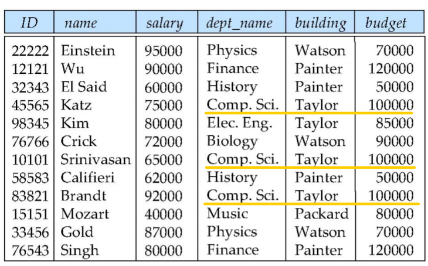
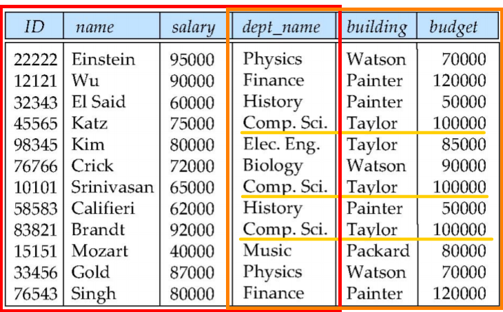
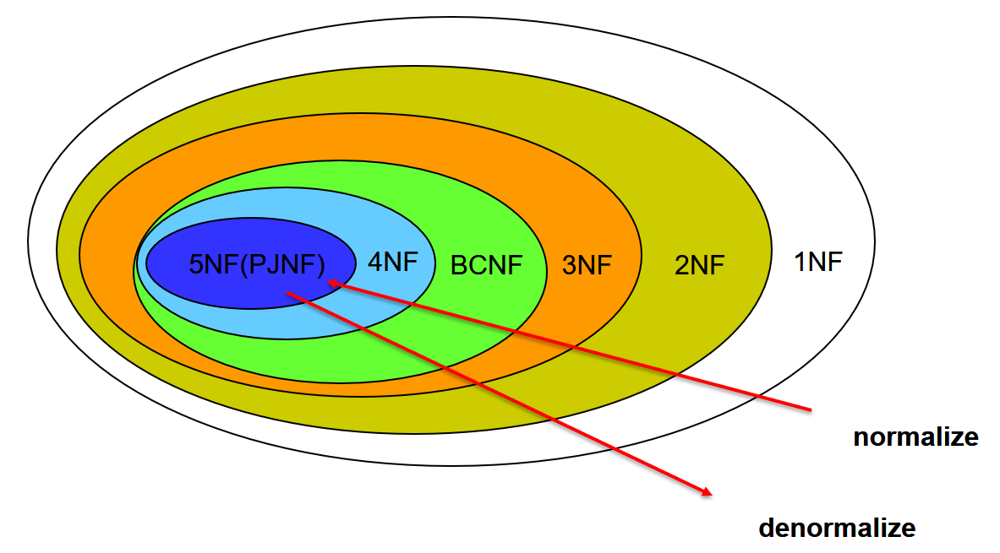

# CH7 Normalization

## Feature of Good Relational Designs

Suppose we combine instructor and department into in\_dept, which represents the natural join on the relations instructor and department

簡單的評斷標準，這個設計有兩個缺點

1. There is repetition of information
2. Need to use null values (if we add a new department with no instructors)

**常見修正方法**

Decompose: 先形成一個 design 慢慢做切割，來改進

> R(a, b, c, d) → R1(a, b, c) & R2(c, d, e)

Merge: 將小的 design 合成大的來改進

> R1(a, b, c) & R2(c, d, e) → R(a, b, c, d)

## Decomposition

The only way to avoid the repetition-of-information problem in the in\_dept schema is to decompose it into two schemas -- instructor and department schemas

Let R be a relation schema and let R1 and R2 from a decomposition o =f

## Normalization Theory

Decide whether a particular relation R is in "good" form

Our theory is based on:

+ functional dependencies
+ multivalued dependencies
+ join dependencies

**Normalization Hierarchy**

## Functional Dependencies

